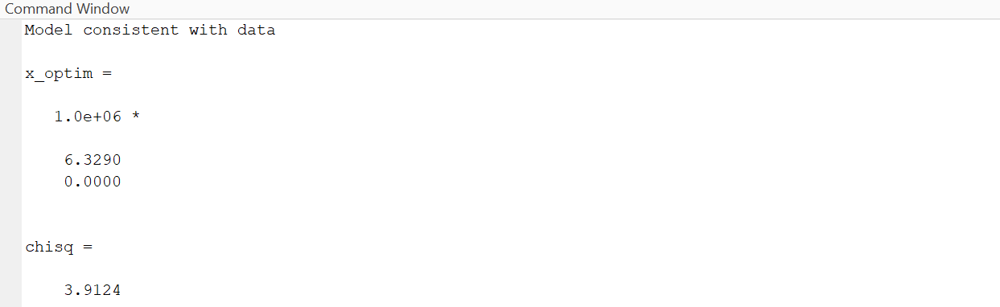
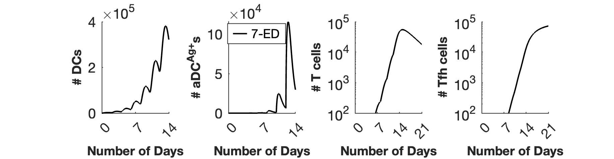
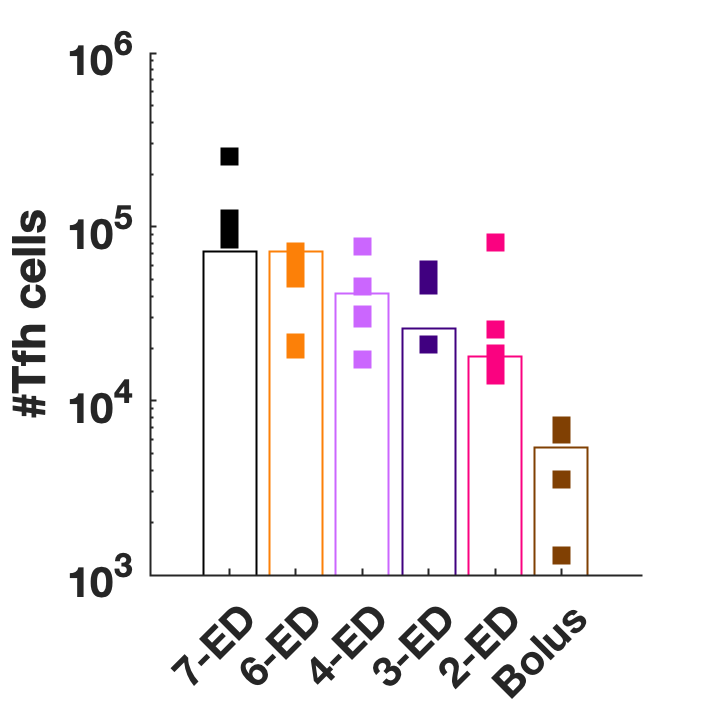

#  Coarse-Grained Model of T cell and B cell Dynamics in Response to Extended Antigen and Adjuvant Priming
Code repository for the following manuscript submitted to Science Immunology.

**Two-dose “extended priming” immunization amplifies humoral immune responses by synchronizing vaccine delivery with the germinal center response**

Sachin H. Bhagchandani<sup>1,2,3,5,7†</sup>, Leerang Yang<sup>1,4,6,7†</sup>, Jonathan H. Lam<sup>5</sup>, Laura Maiorino<sup>2,5,8</sup>, Elana Ben-Akiva<sup>2,5</sup>, Kristen A. Rodrigues<sup>2,5</sup>, Anna M. Romanov<sup>2,5</sup>, Heikyung Suh<sup>5,8</sup>, Aereas Aung<sup>2,5</sup>, Shengwei Wu<sup>5</sup>, Anika Wadhera<sup>2,5</sup>, Arup K. Chakraborty<sup>1,4,6,7</sup>, and Darrell J. Irvine<sup>1,2,5,7,8</sup>

1Department of Chemical Engineering, Massachusetts Institute of Technology, 77 Massachusetts Avenue, Cambridge, MA 02139, U.S.A.
2Department of Biological Engineering, Massachusetts Institute of Technology, 77 Massachusetts Avenue, Cambridge, MA 02139, U.S.A.
3Department of Chemistry, Massachusetts Institute of Technology, 77 Massachusetts Avenue, Cambridge, MA 02139, U.S.A.
4Department of Physics, Massachusetts Institute of Technology, 77 Massachusetts Avenue, Cambridge, MA 02139, U.S.A.
5Koch Institute for Integrative Cancer Research, Massachusetts Institute of Technology, 500 Main Street, Cambridge, MA 02139, U.S.A.
6Institute for Medical Engineering and Science, Massachusetts Institute of Technology, 77 Massachusetts Avenue, Cambridge, MA 02139, U.S.A.
7Ragon Institute of MGH, MIT, and Harvard, Cambridge, MA 02139, U.S.A.
8Howard Hughes Medical Institute, Chevy Chase, MD 20815, USA


† Denotes equal contributions
*Correspondence to: djirvine@mit.edu & arupc@mit.edu

&nbsp;

## Introduction 
###
This model can be divided into two parts:  
(1) It simulates innate immune responses and T folicular helper (Tfh) cell priming in the presence of antigen and adjuvant.  
(2) It simulates GC B cell responses, which depend on the Tfh cells and antigen presentation dynamics. 

### Model of T cell priming
#### Goal:

Simulate the coarse-grained mechanism of T cell priming when exposed to antigen and adjuvant, focusing on the dynamics of innate immune cell recruitment and their interaction with T cells leading to proliferation and Tfh cell differentiation.
#### Approach:

* **Development of the model:** The model was developed from observed experimental observations on adjuvant mechanism, as described in detail in the manuscript. Briefly, upon administration of adjuvants, tissue-resident cells (like neutrophils and macrophages) are drawn to the site. They subsequently recruit DCs, which uptake antigen. Adjuvants boost this process, facilitating efficient antigen uptake and its delivery to DCs. After antigen uptake, activated DCs present pMHC molecules to CD4 T cells, inducing their proliferation and differentiation into Tfh cells.

* **Equations & Dynamics:** The model uses ordinary differential equations to simulate the kinetics of antigen and adjuvant, recruitment of tissue cells, DC activation, antigen uptake, and T cell proliferation and differentiation.

* **Parameters:** Two parameters, $D_0$ and $T_0$, are fitted using a maximum likelihood estimation method. Other parameters derive from literature or reasonable assumptions. 

#### Results:
The model successfully captures the observed dynamics of T cells, and provides insights on the role of timing and doses (Figs 3B-F).

&nbsp;

### Model of B cell response
#### Goal:

Model the B cell response to antigens, focusing on the dynamics of antigen display, activation of naive B cells, affinity maturation, and memory B cell processes.
#### Approach:
* **Development of the model:** The model was adapted from a previously published study (doi.org/10.1016/j.celrep.2023.112256).
* **Equations & Dynamics:** The system uses a combination of differential equations and a stochastic agent-based model. The differential equations describe antigen and antibody concentration updates, and stochastic agent-based model describes B cell actions (activation, division, mutation, differentiation).

#### Results:
The model predicts the dynamics of antigen and antibody concentrations, GC B cell numbers, and Ag-specific B cell response fractions based on various immunization schemes (Fig.4B-G, 6B-I).

### Notes
 For a detailed description of the model, equations, and parameters, refer to the Supplementary Materials.

* Table S2: Summary of T cell model parameters and their values.
* Table S3: Summary of B cell model parameters and their values.

&nbsp;

## Overview
### System Requirement
 **Software:** 
 * MATLAB Version R2020a or newer.

 **Computational Resource:** 
 * High Performance Computing Cluster (HPCC) is recommended although not necessary to reproduce the results. 
 * Requires 100 simulations, each requiring 8G of memory and ~3 hours.

### Installation Guide
1. Clone this repository or download the zip file.
2. Extract the files to your desired location.
3. Open MATLAB and navigate to the directory containing the project files.

### File Descriptions
```
├── Code_Parameter_Generation           : Folder with files for defining simulation parameters
│   ├── baseCaseParameters.m            :    Function that returns an example parameter set
│   ├── createBaseCases.m               :    Creates a text file of parameters for various cases
│   └── createPserParameters.m          :    Creates a text file for running alum-pSER simulation (Fig.6G-I)
├── Code_Simulation                     : Folder with files for simulation B cell responses
│   ├── tcell_functions                 :  Subfolder with files for modeling T cell dynamics
│   │   ├── getInnateDynamics.m         :    Obtain innate immune and T cell dynamics for given kinetic parameters    
│   │   ├── tCellModel.m                :    Model T cell dynamics and plot, with option of parameter fitting
│   │   ├── plotTcellModel.m            :    Quickly plot T cell dynamics with pre-defined kinetic parameters
│   │   └── getNumTcells.m              :    Obtain T cell numbers with pre-defined kinetic parameters
│   ├── concentration_functions         :  Subfolder with functions for modeling concentration dynamics
│   │   ├── epitopeMasking.m            :    Handles epitope masking (inherited from previous; masking not used here)
│   │   ├── getDosingParameters.m       :    Initialize the dosing scheme based on input parameters
│   │   └── updateConcentrations.m      :    Update concentrations during simulation
│   ├── helper_functions                :  Subfolder with various helper functions
│   │   ├── alignLeft.m                 :    
│   │   ├── bit2int.m                   :    
│   │   ├── checkMutationScheme.m       :
│   │   ├── combineArrs.m               :
│   │   ├── getFileLocation.m           :
│   │   ├── int2bit.m                   :    
│   │   ├── res2ind.m                   :    
│   │   └── updateHistory.m             :
│   ├── sim_initialization_functions    :  Subfolder with functions for initialization
│   │   ├── getNaiveBcells.m            :    Initializes the navie B cell germline affinities
│   │   └── initializeParameters.m      :    Initializes all fixed and variable parameters required for simulation
│   ├── runPserWrapper.m                :  Runs alum-pSER simulations; requires parameter inputs
│   └── runGCsMain.m                    :  Runs B cell response simulations; requires parameter inputs
├── Code_Plotting                       : Folder with files for analyzing and plotting the results
│   ├── plotting_results                :  Subfolder with files for plotting
│   │   ├── plotResults.m               :    Creates plots for the B cell responses (Fig.4B-G, 6B-F)
│   │   └── plotPserResults.m           :    Creates plots for alum-pSER simulation (Fig.6G-I)   
│   ├── summarizing_results             :  Subfolder with files for analysis
│   │   ├── compileGCRunResults.m       :    Function for compiling results from repeated simulations
│   │   ├── combineResult.m             :    Function for restructuring and combining the results 
│   │   ├── loadResult.m                :    Function for loading simulation results (by calling the above two)
│   │   ├── summarize.m                 :    Function for getting summary statistics
│   │   ├── summarizeResults.m          :    Analyzes the B cell simulation results and saves summary.mat
│   │   └── pSerSummarizeResults.m      :    Analyzes the alum-pSER simulation results and saves pSER_summary.mat 
│   ├── summary.mat                     :    MATLAB data file with summary statistics of simulations
│   └── pSER_summary.mat                :    MATLAB data file with summary statistics of alum-pSER simulations
├── Data                                : Folder with data files needed
│   └── Tfh_Number_Data.xlsx            :    Experimentally measured Tfh cell numbers
├── Parameters                          : Folder containing text files with parameter inputs
│   ├── Base_cases_summarize.txt        :    Simulation parameters for summarizing; used with summarize.m script
│   ├── Base_cases.txt                  :    Simulation parameters used with runGCsMain.m script
│   └── pSER_params.txt                 :    Simulation parameters for alum-pSER; used with runPserWrapper.m script
├── .gitignore                          : Gitignore
└── README.md                           : README
```
&nbsp;

## Running Instruction
### Model of T cell priming
#### 1. Fitting the parameters $D_0, T_0$ and obtaining the DC, antigen-loaded DC, T cell, and Tfh cell dynamics
```MATLAB
cd Code_Simulation/tcell_functions
[x_optim, chisq, params_guess, res, exitflags] = tCellModel(1)
```
[x_optim, chisq, params_guess, res, exitflags] = tCellModel(1)
**Outputs:**  
(1) Outcome of the parameter fitting  
(2) Plots of the cell dynamics and comparison of Tfh cell numbers

  

  

#### 2. Plotting the cell dynamics with pre-determined $D_0, T_0$ without fitting
```MATLAB
cd Code_Simulation/tcell_functions
run plotTcellModel
```
&nbsp;

### Model of B cell response  
#### 1. Creating text files with parameters for simulations
(If you downloaded the entire repository, the text files are already contained in the folder 'Parameters', and this step may be skipped.)  
In MATLAB editor:
```MATLAB
cd <path>/Code_Parameter_Generation
run createBaseCases
run createPserParameters
```
This creates the three text files in the folder 'Parameters'. 

#### 2. Running simulations
We provide instructions for running the simulation using a High Performance Computing Cluster with slurm workload manager. The instructions should be adapted to a specific computing platform being used. After logging into the cluster, upload the entire repository.  
In Linux Shell:
```bash
cd <path>/Code_Simulation
mkdir slurm_output
chmod +x submitToSlurm
./submitToSlurm runGCsMain < ../Parameters/Base_cases.txt
./submitToSlurm runPserWrapper < ../Parameters/pSER_params.txt
```
**Output:**  
When the simulations have successfully run, folder 'Data' is created within 'Code_Simulation'. This folder contains multiple subfolders, which contain MATLAB data files. We can quickly check if the correct numbers of data files have been saved. 
```bash
find <path>/Code_Simulation/Data/ -type f -name "*.mat" | wc -l
```
The output should be 130. 


#### 3. Analyzing the results

In Linux Shell:
```bash
cd <path>/Code_Plotting/summarizing_results
chmod +x submitSummarize.sh
sbatch submitSummarize.sh summarizeResults
sbatch submitSummarize.sh pSerSummarizeResults
```


#### 4. Plotting the results
Plotting can be done on the local machine. Download the data files 'summary.mat' and 'pSER_summary.mat' in the folder 'Code_Plotting'.

In MATLAB editor: 
```MATLAB
cd plotting_results
run plotResults
run plotPserResults
```


&nbsp;

## Contact
For questions, contact Leerang Yang (leerang@mit.edu)
